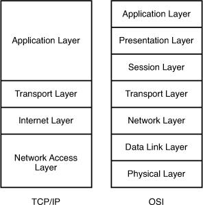
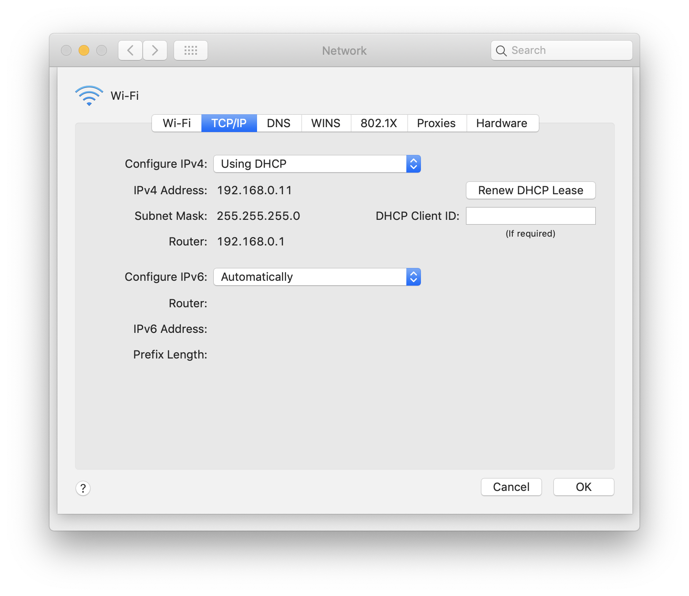

# Networking

## A piece of data
1 bit: 0 or 1       
1 Byte: 8 bits, E.g. An alphabet is 1 Byte      

| speed | data |
| -- | -- |
| 1024 bits = 1 kilo bits = 1Kb | 1024 Byte = 1 kilo Byte = 1KB |
| 1024 Kb = 1 mega bits = 1 Mb | 1024 KB = 1 mega Byte = 1 MB |
| 1024 Mb = 1 giga bits = 1 Gb | 1024 MB = 1 mega Byte = 1 GB |
| 1024 Gb = 1 tera bits = 1 Tb | 1024 GB = 1 tera Byte = 1 TB |

> Q: How long will it take for a 128 KB file to go access at 1 Mbps?      
> A:      
> 1 Mbps = 1 Mb/s = 1024 Kb/s     
> 128 KB = 128 * 8 Kb    
> It will take 128 * 8 / 1024 = 1 (sec)       

## TCP/IP Model & OSI Model
     

> How do you remember it?       
> OSI model:      
> Please Do Not Throw Sausage Pizza Away      
> All Pizzas Seem To Need Double Pepperoni        
> 
> TCP/IP model:       
> TCP/IP comes in "A TIN"

#### 7. Application Layer
1. Communicate with "network aware" application.       
2. All the protocols work on this layer: HTTP, SMTP, FTP, TFTP, DNS, etc.       
#### 6. Presentation Layer
1. Convert and encrypt data.

#### 5. Session Layer
1. A layer where construction, direction and conclusion of connection between devices occur.        
2. Support multiple types of connections.        
3. Be responsible for authentication and reconnection       


#### 4. Transport Layer
1. Be responsible for transmission of data across network connections.     
2. Coordinate how much data to send, how fast, where it goes, ect.      
3. Of the most widely known protocols for internet applications, these services may be provided by TCP (Transmission Control Protocol) and UDP (User Datagram Protocol).        
4. Other protocols may provide digital capability including air recovery, data flow and retransmission.     

#### 3. Network Layer
1. Handle the routing of the data.       
2. ARP (Address Resolution Protocol): Map between logical addresses and physical addresses.     


#### 2. Data Link Layer
1. The most complex layer.       
2. Be divided by sublayers - MAC (Media Access Control) and LLC (Logical Link Control).      
3. Set up links across the physical network. When this layer receives data from a physical layers, it packages the bits into data frames.       
4. Manage physical addressing methods for the MAC or LLC layers.        

#### 1. Physical Layer
1. Network cables, power plugs, cable pinouts, wireless radio frequencies, connectors, transceivers, receivers, repeaters, pulses of light, electric voltages, etc.     
2. Transmit the digital data bits from the source or sending devices' physical layer over network communication media, which can be electrical,  mechanical or radio to the receiving or destination devices' physical layer. 


## IP, Internet Protocol

     

1. 4 octet      
Octet: an octet is nothing but an 8       
```192.168.0.11``` = ```11000000 10101000 00000000 00001011```       

2. 5 classes        
IPv4 classes identified by the first octet.     
Class A: 1 - 126        
Class B: 128 - 191      
Class C: 192 - 223      
Class D: 224 - 239      
Class E: 240 - 255      

We've been only dealing with class A, B and C. Class D is used for multicast and class E is reserved for experimental purposes.     

```127.X.X.X``` is used for lookback        

3. 0 - 255      
0 (```00000000```) - 255 (```11111111```)       

4. 32 bits      
5. Host/Net     
```A.A.A.B```: A (the first three octets) is the net part, and B is the host part

### IPv4 Address
The 4th version of internet protocol        


#### Class C ip address
```
192.168.100.host
```
- Network id: 192.168.100.0       
- Broadcast id: 192.168.100.255     
- A valid ip address starts from ```192.168.100.1``` to ```192.168.100.254```     
- Imagine that ```192.168.100``` is like a hotel with 254 (2^8-2) rooms. 

#### Class B ip address
```
172.123.host.host
```
- Network id: 172.123.0.0        
- Broadcast id: 172.123.255.255     
- valid ip addresses start from ```172.123.0.1``` to ```172.123.255.254```        
- A hotel with 65,534 (2^16-2) rooms.

#### Class A ip address
```
100.host.host.host
```
- Network id: 100.0.0.0       
- Broadcast id: 100.255.255.255     
- valid ip addresses start from ```100.0.0.1``` to ```100.255.255.254```        
- A hotel with 2,097,150 (2^24-2) rooms.

### Subnet Mask
- Subnet mask is decided by the class. A class C ip address, the subnet class is ```255.255.255.0``` (```11111111 11111111 11111111 00000000```)      
- If you see something like ```192.168.0.11/24```, the ```/24``` means that the subnet mask has 24 ```1```. A subnet mask with 24 ```1``` is nothing but a class C ip address.       

| class | subnet mask |
| -- | -- |
| C | 255.255.255.0 |
| B | 255.255.0.0 |
| A | 255.0.0.0 |


### Router, gateway     
NOTICE, gateway and ip address have to be in the same network, i.e. if the ip address is ```192.168.100.11```, gateway must be ```192.168.100.xx```


> Q:

## IPv6
The 6th version


## References
[Full Series | 200-125 CCNA v3.0 | Free Cisco Video Training 2018 | Networking Inc.](https://www.youtube.com/playlist?list=PLh94XVT4dq02frQRRZBHzvj2hwuhzSByN)