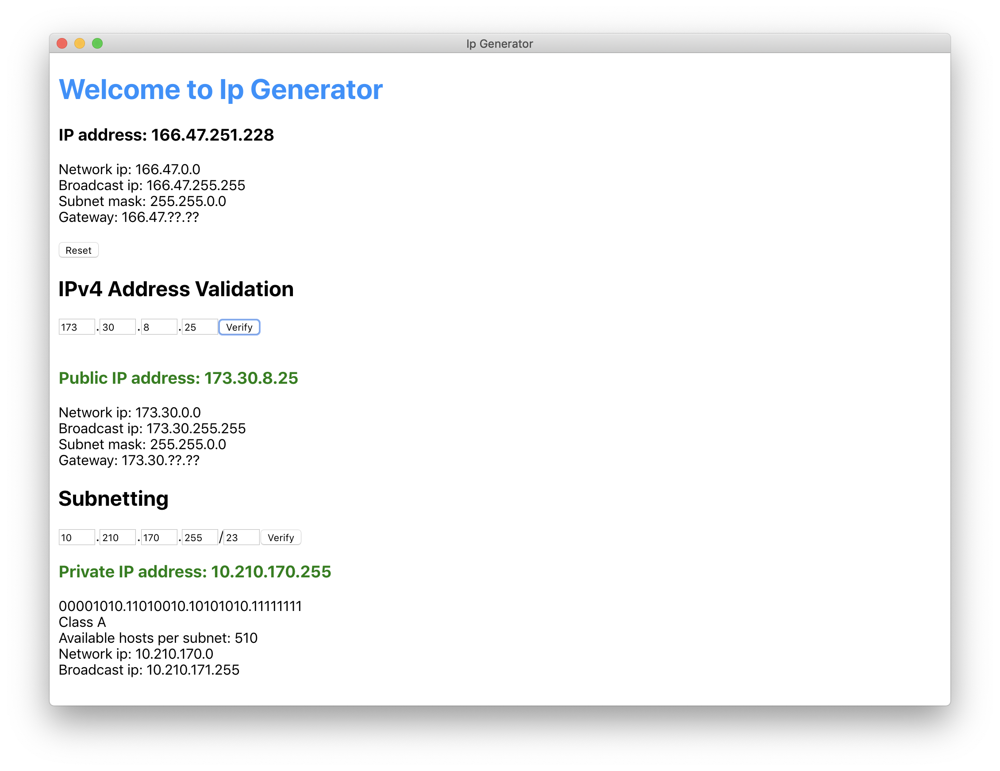

# IPv4 Generator
Cross-platform application based on Electron + React framework



## Build

You could either build an desktop application or just run the html file on browsers.       
The executable file will be packaged to ```dist/```     


Install node modules
```shell
npm install
```

### Option1, build applications via npm and execute
```shell
npm run electron-dev
```

### Option2, package to an app
```shell
npm run electron-pack
```

## Features
1. Generator a random IPv4 address      
2. Verify any given IPv4 address        
3. Subnet

## References
[How to build an Electron app using Create React App and Electron Builder](https://www.codementor.io/randyfindley/how-to-build-an-electron-app-using-create-react-app-and-electron-builder-ss1k0sfer)